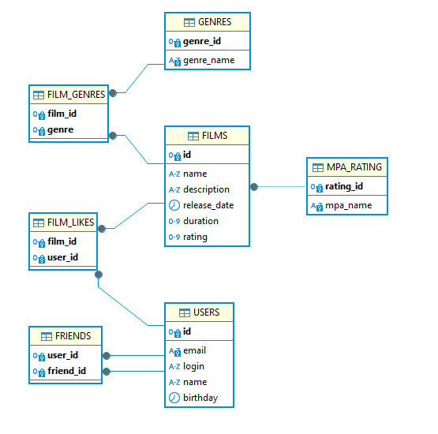

# java-filmorate




# Основные операции

### Получение списка фильмов
```sql
SELECT *
FROM film;
```
### Получение списка пользователей
```sql
SELECT *
FROM user;
```
### Получение 10 самых популярных фильмов
```sql
SELECT f.name,
COUNT(fl.user_id) as likes
FROM film AS f
JOIN film_likes AS fl ON f.id = fl.film_id
GROUP BY f.name
ORDER BY likes DESC
LIMIT 10;
```
### Получение списка друзей пользователя c id 3
```sql
SELECT u.login
FROM user as u
WHERE u.id = (SELECT friend_id FROM friends
WHERE user_id = 3 AND confirmed IS TRUE);
```
